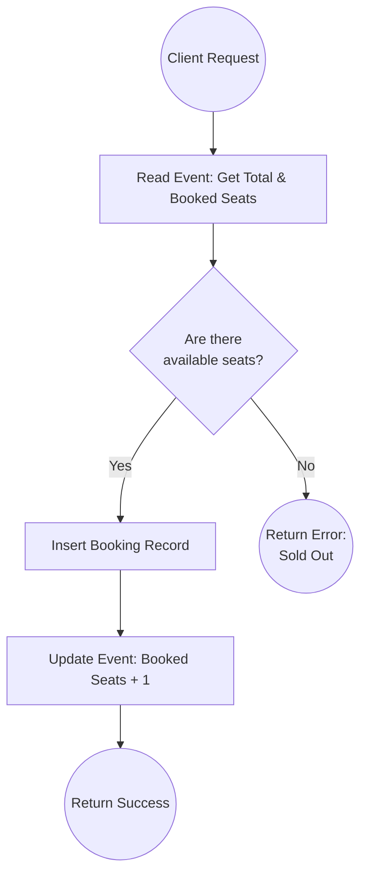
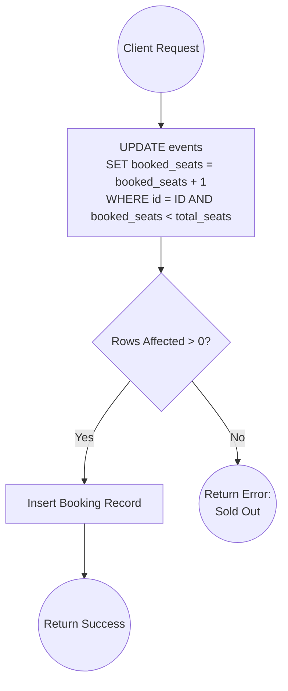
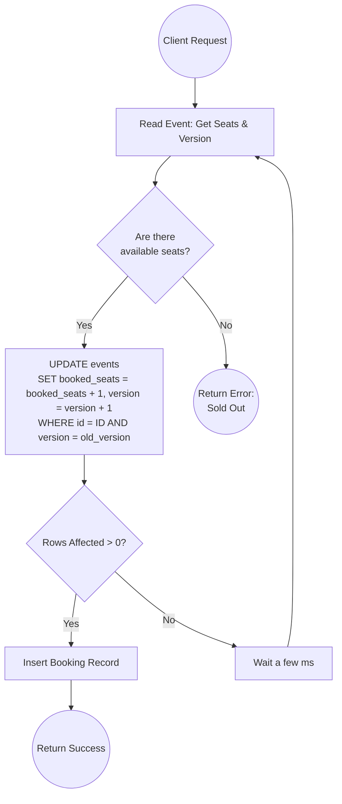
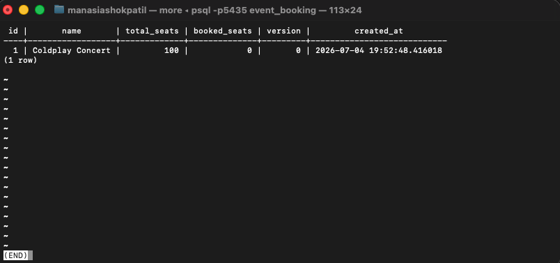
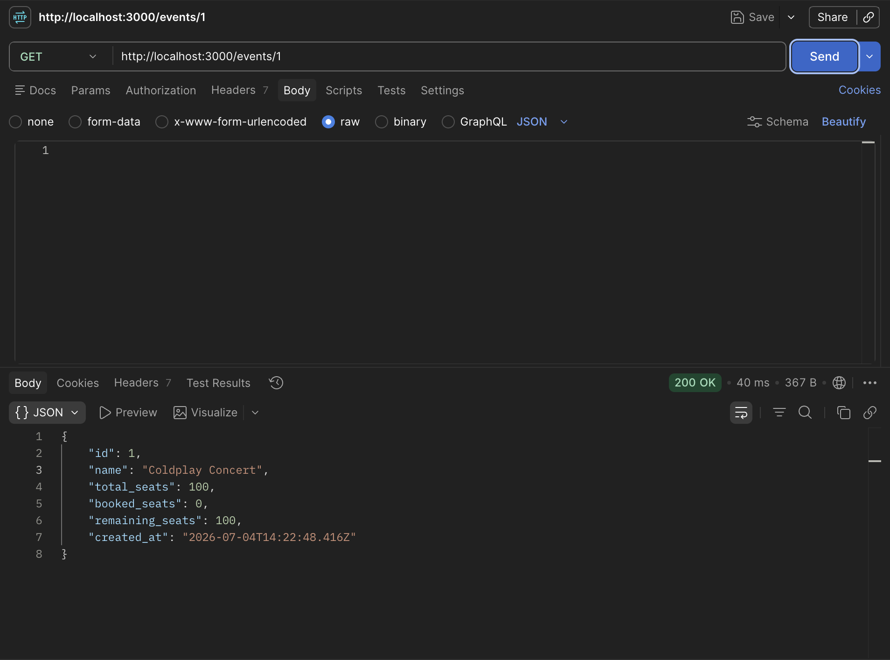
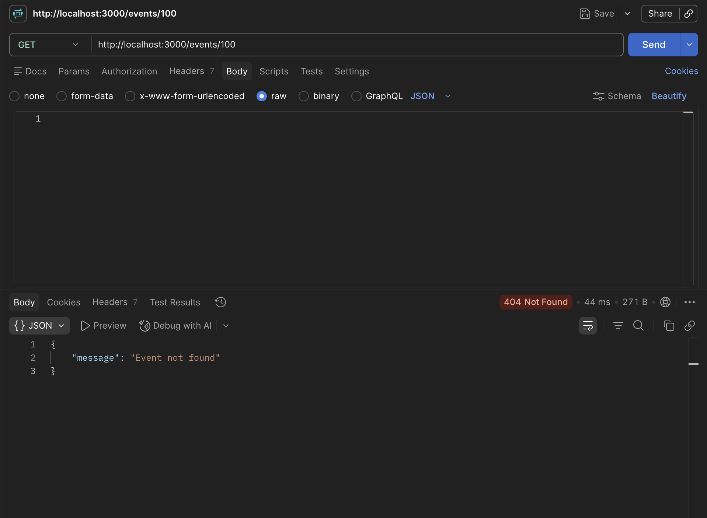
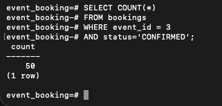
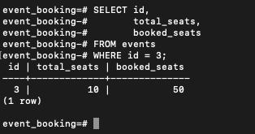

# Event Booking System

This project is a back-end system for an event booking application, built with Node.js, Express, and PostgreSQL. It focuses on solving the critical problem of **concurrency and race conditions** when multiple users attempt to book the last available seats simultaneously.

## Tech Stack
* **Language:** JavaScript (Node.js)
* **Framework:** Express.js
* **Database:** PostgreSQL

## Project Structure
* `src/config`: Database connection configuration.
* `src/controllers`: Request handlers for events and bookings.
* `src/services`: Business logic and database interactions.
* `src/routes`: API endpoints definition.

## Concurrency Handling Approaches

When building a booking system, handling high concurrency safely is crucial. Below are flowcharts explaining three different approaches to handling seat bookings, highlighting their benefits and pitfalls.

### 1. Naive Implementation
The naive approach reads the available seats, checks if there is space, and then updates the record. This is highly susceptible to race conditions (overbooking) under high traffic, as multiple transactions might read the same initial value before any of them update it.



### 2. Atomic Conditional Update
Instead of reading and then updating, this approach uses an atomic database update operation with a `WHERE` clause to check the condition. If the update fails (no rows affected), it means there were no seats available.



### 3. Optimistic Locking (Current Implementation)
This approach adds a `version` colum to the event record. It reads the current state and version, and later attempts to update *only if* the version hasn't changed. If the version has changed (someone else booked a seat in the meantime), it retries the operation. This is efficient for read-heavy systems and guarantees data integrity.



## Application Screenshots

Here are some screenshots demonstrating the system's behavior:







## Setup & Running

1. **Install Dependencies:**
   ```bash
   npm install
   ```

2. **Environment Variables:**
   Create a `.env` file in the root based on your database setup:
   ```env
   DB_USER=your_db_user
   DB_PASSWORD=your_db_password
   DB_HOST=localhost
   DB_PORT=5432
   DB_NAME=event_booking
   PORT=3000
   ```

3. **Start the Server:**
   ```bash
   node src/server.js
   ```
